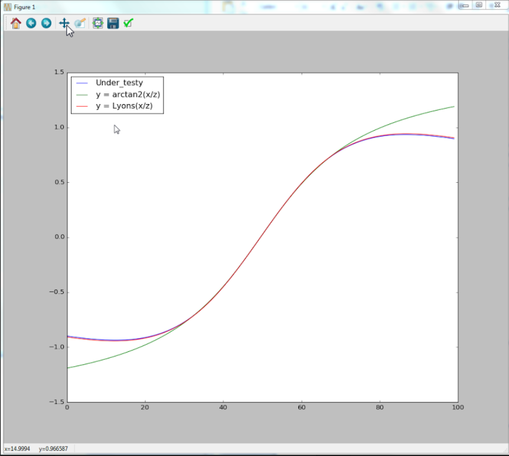

# How to be a scientist for one day
A true story with code and a guide to the adventurer.

## The wonderful story of a fun day

Hello to all of you, <br>
<br>
Today I will tell you a wonderful story. <br>
<br>
Some time ago in a weekend, I turned the TV on and the only thing that was talked about was a football match that would happen in that day. And I started to think that, then in that day the game would be in the TV, and in the end of the day, all the news programs would be discussing the game. <br>
<br>
Because that was kind of boring, I decided that I would do something different, but what could I do? <br>
<br>
What could I do of fun in that day so that I wouldn't felt so bored? <br>
<br>
How about, if I tried to be a scientist for one day? Trying to be in the skin of a researcher for one day! I'm not a researcher and even less a scientist, and because of this I would simply be playing and pretending to be a scientist. But because it would be only for one day, it could be something fun to do! <br>
<br>
I would see this as a fun adventure! Kind of, a walk in the world of Alice in the Wonderland :-D <br>
<br>

## What would be the research about?

Then came the obvious question: <br>
<br>
What would be my research about? <br> 
<br>
It should be something very precise and it should not be very complex, something that I could do, test and run experiments in one day.<br>
<br>
Then I remembered something that I had read some time ago in a fantastic book of DSP - Digital Signal Processing: <br> 

* Understanding Digital Signal Processing 3rd Edition <br>
by Richard G. Lyons 

In this book, is written that: the calculation of the arc of tangent, arc tan( x / y ) is heavily used in DSP and because it's normal calculation is made using a Taylor series expansion it would be very slow in terms of performance to calculate each value of the function. <br>
<br>
When this function is calculated in DSP, normally there is the need to perform this calculation a high number of times per second. For this reason, we have to find a simple way to calculate the arctan, without making use of the Taylor series expansion. Normally what is used is one approximation of that function that is computationally lighter. <br>
<br>
Prof. Lyons says clearly in his book, that if some reader finds a better approximation to the existing ones that he should contact him! <br>
<br>
That means that I have here a good objective to my research for one day, something concrete, something contained, and that if I could find something new, it would be relevant to the society! <br>  
<br>
Spoiler alert: I didn't found a better result than the existing ones, but the journey was fun and interesting! <br>
<br>
When, sometime ago, I was implementing the ArcTan(x/y) in the area of acoustics, I noticed that almost all the internet (papers, forums and open source projects) used the approximation given by Prof. Lyons in the article for the IEEE magazine with the title: <br>

* [Another Contender in the Arctangent Race](https://www.researchgate.net/publication/3321505_Another_Contender_in_the_Arctangent_Race)

The equation that Prof. Lyons used in the article was: <br>
<br>
Arctan(q/i) = (q x i)  /  ( i^2 + 0.28125 x (q^2) ) <br>
with -1 <=  q / i <= 1 that means that the angle phi of arc tan is between –pi/4 <= phi <= pi/4  <br>
<br>
In the article the equation is then expanded so that it adapts to the 8 octants of the argand plane. <br>
<br>
One other important note that is explained in the article by Prof. Lyons, is about the constant in the equation: <br>
<br> 
*“The product 0.28125 x Q^2 equal to(1/4 +  1/32)x Q2,  so  we  can  implement  the  product  by  adding  Q^2 shifted right by two bits to Q^2 shifted right by five bits.”* <br>
<br>
And explains why the multiplication by that constant is something computationally simple and light to do on a DSP or micro-controllers without floating point unit, because we only need to make shifts. <br>
<br>
Well, then the objective of our research is to find one equation that is in terms of computational weight performance, identical to the approximation from Prof. Lyons, but that has less approximation error to the real function of arctan(x/y) calculated by the infinite Taylor series expansion for each point. <br>    

## ...starting to attack the problem....

The operations that this equation of arctan(x/y) can have are the following: <br>
+, -, x, /, neg (negative of a number), variable X, variable Y and each one of the possible binary constants. <br>
<br>
List of the binary constants that can be multiplied or divided using only shift left or shift right <br>

```
   2^0 = 1 
   2^1 = 2      and  1 /2
   2^2 = 4      and  1 /4     
   2^3 = 8      and  1 /8
   2^4 = 16     and  1 /16
   2^5 = 32     and  1 /32
   2^6 = 64     and  1 /64
   2^7 = 128    and  1 /128
   2^8 = 254    and  1 /254
   2^9 = 512    and  1 /512
   2^10 = 1024  and  1 /1024
```

When we see the equation of Prof. Lyons and we see that it's so simples and so small, we can't stop thinking that the space of all possible solutions is very small. That means that the number of all combinations of all equations that have the same number of operations of the equation by Prof. Lyons is small and because of that we can do a very simple program that generates all the possible combination. Then for each one calculate the error and in that way it finds a better equation then the Prof. Lyons one, if there exists one. <br>
<br>
At this point we will make a very simple estimation and just in the right ball park. If we represent the Prof. Lyons equation by a tree of nodes, and that each node is one mathematical operation, a variable or a constant. How many nodes would we have? <br>
<br>   
We would have 15 nodes, if we imagine one tree with 15 nodes we would have the following 28 different combinations for each node that would be like the following tree.

```
  _____+_____
  __-_____x__
  _1_X___Y_X_

  ______________28______________
  ____28_________________28_____
  _28______28________28_____28__
  28_28__ 28_28_____28_28__28_28

```

Doing some back of envelope calculations and knowing that the real value is a little bit smaller, because not every possible tree is a complete tree. If a variable or a constant is in one node and there is no node bellow. But at least is an indicative value. <br>
<br>
The total number of different combinations would be the number of combinations in each node raised to the power of the number of nodes. Number_combinations ^ number_of_nodes = 28^15= 5.09x10^21 . This is the number of different combinations and it is really high, we clearly can't generate all combinations and test them all. <br>
<br>
Just for a comparison, a processor works at 5 GHZ that is 5x10^9, and from 10^9 to 10^21 goes a great distance! For this reason, an exhaustive search and test (brute force approach) of all the possible equations with 15 nodes is simply impossible with the computers that we have. <br>
<br>
Our first idea doesn't work and we have to let it go! <br>
<br>
But we want to be scientists for one day and the day is not over yet! Then, what other ideas come to our mind? <br> 
<br>
We can apply a linear regression of degree one or of a superior degree, but that would not give us a better approximation that the one found by Prof. Lyons, for that reason it wouldn't be a real solution. <br>
<br>
We couldn't use Machine Learning regression algorithms or techniques because they are all computationally heavy to calculate in real time in a DSP or micro-controller. <br>  

## ...the plot is thickening...

Now, this is looking like a much more difficult mission that we were thinking about when we started it! <br>
<br>
I'm not a mathematician and I don't have a "magic" card in my sleave of fantastic mathematical knowledge that I can use! <br>
Or is there something in my sleave that I can use? <br>
<br>
Many years ago, I have studied deeply about an incredible artificial intelligence technique called GP - Genetic Programming. In a few word, genetic programming is a method of search in the space of possible and executable programs (normally tree's that represent programs). This method is inspired by the natural selection of the fittest individuals, to cross and mutate individuals in a population. To create one generation after the other that have a smaller error it a scoring function (the fitness function). That is, it creates a kind of pressure for the more fit in each generation to survive and have descendants. Allowing the search to be guided in that general direction direction. <br>   
<br>
What we are seeking is an equation and we already have seen that it could be represented by a tree. We can also see that it is a kind of executable program, if we calculate the nodes in the tree over the values of the test set. ex: 10.000 random values of the equation in the intervals for each parameter of X and Y. <br>
<br>
So now we are back, and have a plan of action! Cool! Let's work on it.<br>
<br>
To know more about GP see the following site: <br>
[Genetic Programming org](http://www.genetic-programming.org/)
<br>
Some of the best books on GP are the 4 book collection from Prof. Koza:<br>

* Genetic Programming: On the Programming of Computers by Means of Natural Selection 1992 <br>
by John R. Koza

* Genetic Programming II: Automatic Discovery of Reusable Programs 1994 <br>
by John R. Koza

* Genetic Programming III: Darwinian Invention and Problem Solving 1999 <br>
by John R. Koza and Forrest H. Bennett III

* Genetic Programming IV: Routine Human-Competitive Machine 2003 <br>
by John R. Koza and Martin A. Keane 

This technique is really very powerful and while we study it, we start literally thinking about all the things that can be made with it. Prof. Koza and other have shown that is possible to rediscover patent's with this technique and they did the first patent totally made by a computer. <br>
<br>
But after thinking for a little bit, ...several years ago, when I was implementing GP from zero, GP was complex and it was a lot of work! But now the times are different and there are available several GP frameworks. After a small search I have found one that is well documented and that is of simple use. And best of all, it already had a simple example of a symbolic regression that I could use as a starting point to modify in order to solve my special problem. <br>
<br>
Framework of Genetic Programming for Python: <br>
DEAP is a novel evolutionary computation framework for rapid prototyping and testing of ideas <br>
[DEAP - Distributed Evolutionary Algorithms in Python](https://github.com/DEAP/deap) <br>
[DEAP documentation](https://deap.readthedocs.io/en/master/) <br>
<br>
My idea, was to use this simple symbolic regression example, that come with DEAP and to modify it to my specific case, using it as a tool to solve our problem. The code is in this github repository, so that you can run it and modify it. <br>
<br>
Some modifications that I made to it was: The creation of test cases, I modified it so it could use two input variables, I added binary constants, I made a new fitness function (evaluation of each individual), I made a plot for the best equations. Then to re-write the equations in the format different from postfix and then it was necessary to simplify the equations on: <br>
<br>
[Wolfram: Simplify Algebraic Expressions calculator](http://www.wolframalpha.com/widget/widgetPopup.jsp?p=v&id=7014d9722bc42de3f621eaad1da2615e&title=Simplifying+Algebraic+Expressions+Calculator&theme=blue&i0=9x-9y%5E3&podSelect) <br>
<br>
Then comes the "magic" part that I would stay sited while waiting that the computer made the research for me, in which he travel in the digital skies and found me, equation after equation that approximate better and better the arctan(x/y). <br>
<br>
If I'm not mistaken, I did runs of 40 generations with a population of 10.000 individuals. Then I did several runs of 100.000 individuals and then I did one or two of 1.000.000 individuals. All evolving and competing inside my computer!!! Simply magnificent! <br>
<br>
The last one that I did, I let the computer work on it all night, evolving (crossing and mutating the individuals in each generation) and testing the fitness function, coming with better and better approximation equations. <br>
<br>
I have found several equations and the best that I have found was one of our old friends. My simple small program had rediscovered exactly the Prof. Lyons approximation equation to the ArcTan( X / Y ). I was very happy! That meant that my program was working correctly and that it was a really good approximation. <br>
<br>
You can see in the following graphic the equation arctan(x/y), my approximation equation and Prof. Lyons equation.<br>
<br>
Graph 1:<br>



## Conclusion
In conclusion, if you ask me, if I have discovered something new? A better approximation then Prof. Lyons, the answer is a clear No, but if you ask me if I have made science for one day? The answer is Yes, because the algorithm rediscovered Prof. Lyons equation. Because of that, it was a very enthusiastic and fun journey! And this proves that anyone can become a amateur scientist we only need to be willing to explore and give our time. If I can do it, you can do it! <br>
<br>
Today I decided to share my story with you and publish it in this repository along the code. To motivate you to try to be a scientist for one day, you will see that it is really fun! <br>

## The code
The code is in Python, is simple, small and easy to understand. It runs over the on framework DEAP (see its documentation), but it's not very pretty because it is the product of many modifications between each of the many experiments. And in the interest of the story I wanted to maintain those modifications and imperfections in the code.

## License
GNU Lesser General Public License along with EAP.

## Have fun!
Best regards, <br>
Joao Nuno Carvalho <br>